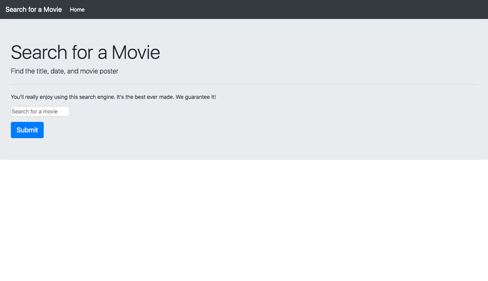
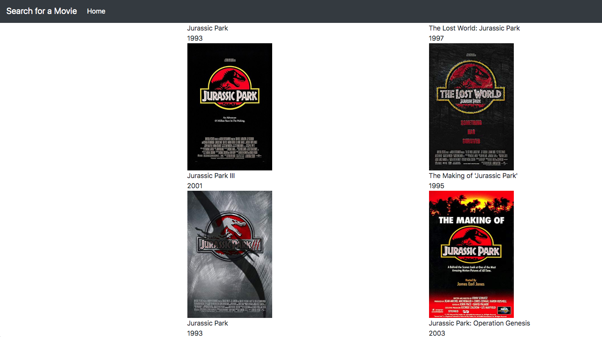

For this part of the exam, you will build a simple movie application.  **To help you complete this on time, the back-end _suggested_ code has been provided.**

On the home page, users can search the title of a movie. When they hit the submit button, they are taken to a results page that displays the titles, dates, and movie posters.

The home page should look like this (you may use any image for background):

When they click on the button, they are taken to a page that looks like this (note that the movies listed may be different from you have): 

You will use the Online Movies Database API, which is found at http://www.omdbapi.com. You will need to carefully read the documentation to figure out how to properly make queries. This site also requires an API key; it is free to register,or if you prefer to use instructors API key. The link is OMDb API: http://www.omdbapi.com/?i=tt3896198&apikey=1d3975f. (Note that each account is limited to 1,000 daily requests).

You will use Node, EJS, the request module, and Express to build this application. Use Bootstrap for styling.
