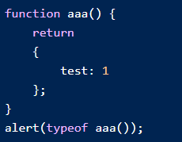

What would be the output of the following code snippet.  Why?  Correct the code if possible.

### Solution here please ...
The output is undefined because there is no semicolon.
JS puts a semi-colon after "return". Nothing is defined.

function aaa() {
return  {test: 1};
}
alert(typeof aaa());

This code will return "object" typeof

